# SpringCloud集成Consul自定义注册服务实例ID

在搭建SpringCloud集成Consul注册中心，发现相同的服务同时注册的时候，默认实例ID的构成是{服务名}:{应用端口}，多个实例部署的话会出现相互覆盖的情况，因此对于这种情况我的想法是自定义服务注册的实例ID，具体组成格式为{服务名}:{服务IP}:{应用端口}避免被覆盖，接下来通过源代码来分析应用是如何完成服务自动注册的。

1. 首先查看Consul自动配置类ConsulAutoServiceRegistrationAutoConfiguration中的consulAutoServiceRegistrationListener方法(如下图)，他创建了一个Consul注册监听器。

   

   

2. 进入ConsulAutoServiceRegistrationListener类中查看onApplicationEvent方法，此方法是监听容器初始化事件，当容器初始化的时候会调用ConsulAutoServiceRegistration实例的start方法(如下图)。

   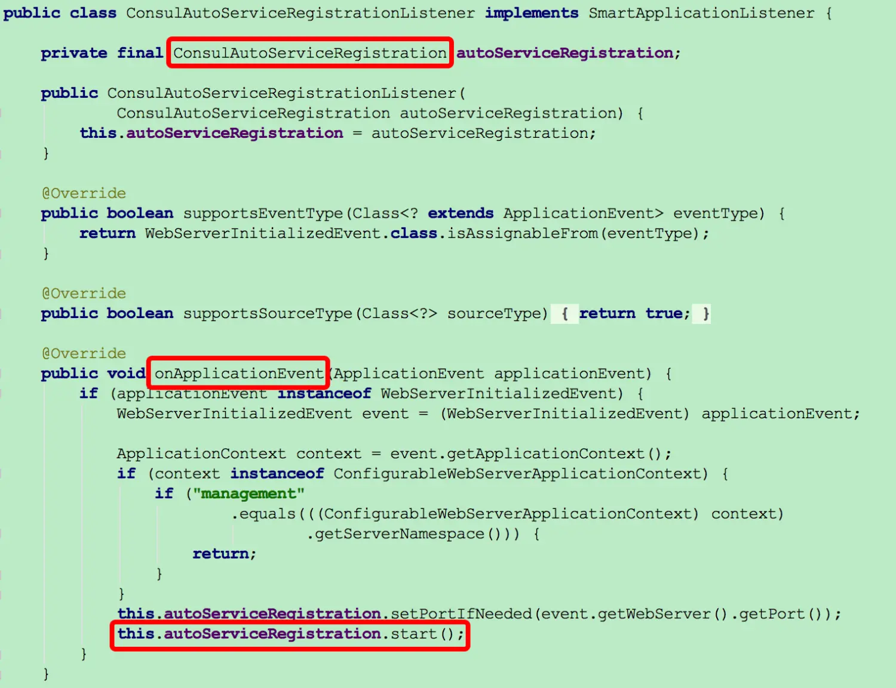

   

3. 进入ConsulAutoServiceRegistration类中查看start方法，发现调用父类AbstractAutoServiceRegistration的start方法(如下图)，

   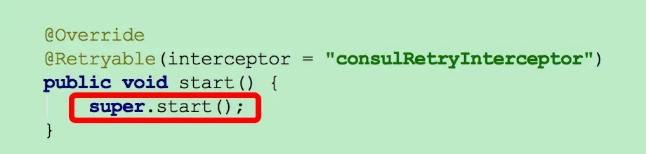

   进入AbstractAutoServiceRegistration的start方法中，调用register方法(如下图)，

   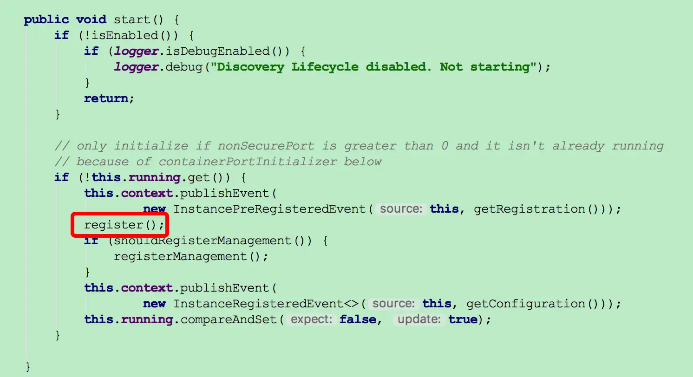

   进入register方法中，他调用的是ConsulServiceRegistry实例的register方法，并且此方法传的参数是getRegistration方法的返回值(如下图)，

   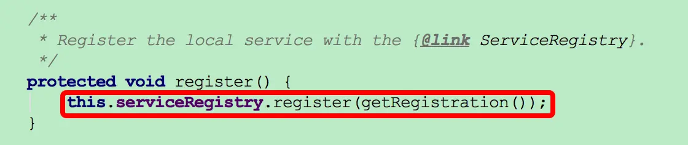

   而getRegistration方法是个抽象方法，具体由ConsulAutoServiceRegistration类实现的，此方法返回的是ConsulAutoRegistration类实例(如下图)，ConsulAutoRegistration类实例创建过程我们后续说。

   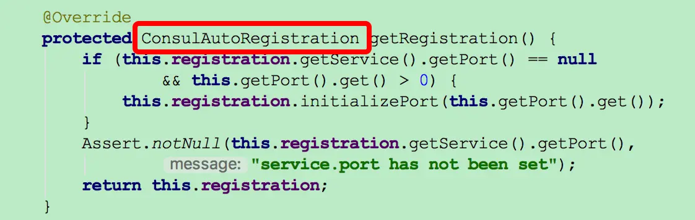

   

4. 先回到ConsulServiceRegistry的register方法，此方法就是通过Consul客户端API，往服务端注册应用服务实例信息(如下图)，

   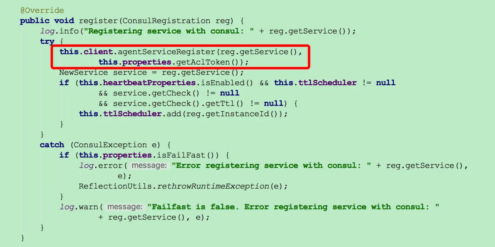

   具体注册过程是调用AgentConsulClient类的agentServiceRegister方法进行注册(如下图)：

   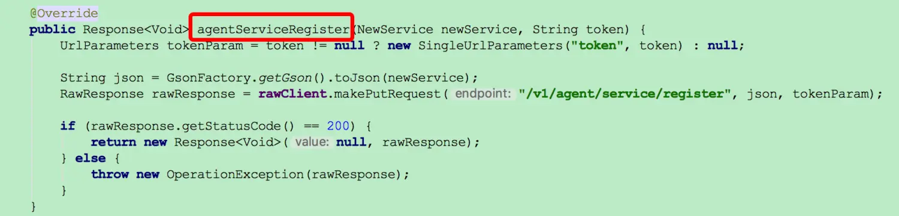

   此时我们已经找到如何自定义服务实例注册信息，即只要**继承ConsulServiceRegistry类覆写register方法**，并且自定义服务实例ID即instanceId即可，具体实现如下：

   ```java
   /**
    * 自定义Consul服务注册
    */
   public class MyConsulServiceRegistry extends ConsulServiceRegistry {
   
       /* 服务名称 */
       private String serviceName;
   
       /**
        * 自定义构造器
        * @param client
        * @param properties
        * @param ttlScheduler
        * @param heartbeatProperties
        * @param serviceName
        */
       public MyConsulServiceRegistry(ConsulClient client,
                                      ConsulDiscoveryProperties properties,
                                      TtlScheduler ttlScheduler,
                                      HeartbeatProperties heartbeatProperties,
                                      String serviceName) {
   
           super(client, properties, ttlScheduler, heartbeatProperties);
   
           this.serviceName = serviceName;
       }
   
       /**
        * 自定义注册服务实例  instanceID -> appName:addr:port
        * @param reg
        */
       @Override
       public void register(ConsulRegistration reg) {
           NewService service = reg.getService();
   
           // 设置服务名、实例ID
           service.setName(this.serviceName);
           service.setId(Joiner.on(":").join(this.serviceName, service.getAddress(), 
                                             String.valueOf(service.getPort())));
   
           super.register(reg);
       }
   }
   ```

   

5. 创建自定义的ConsulServiceRegistry实例，并通过@Primary注解设置高优先级：

   ```java
      /**
        * 实例化自定义Consul服务注册
        * @param client
        * @param properties
        * @param ttlScheduler
        * @param heartbeatProperties
        * @param environment
        * @return
        */
       @Bean
       @Primary
       public ConsulServiceRegistry consulServiceRegistry(ConsulClient client,
                                                          ConsulDiscoveryProperties properties,
                             @Autowired(required = false) TtlScheduler ttlScheduler,
                                                          HeartbeatProperties heartbeatProperties,
                                                          ConfigurableEnvironment environment) {
   
           String serviceName = environment.getProperty(PropertiesUtil.SPRING_APP_NAME, StringUtils.EMPTY);
   
           return new MyConsulServiceRegistry(client, properties, ttlScheduler, heartbeatProperties, 
                                              serviceName);
       }
   ```

   

6. 回过头来我们看下默认服务实例ID是如何实现的，进入AbstractAutoServiceRegistration类中的getRegistration方法，此方案是个抽象方法，具体实现是ConsulAutoServiceRegistration类，此实现方法返回的是ConsulAutoRegistration类实例(如下图)，

   

   我们看下ConsulAutoRegistration实例是如何创建的，进入ConsulAutoServiceRegistrationAutoConfiguration类中查看consulRegistration方法，发现是通过ConsulAutoRegistration的registration方法创建的(如下图)，

   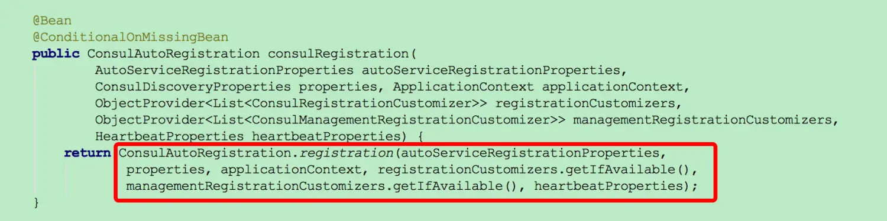

   进入ConsulAutoRegistration类的registration方法，发现实例ID的生成是通过getInstanceId方法产生的(如下图)，

   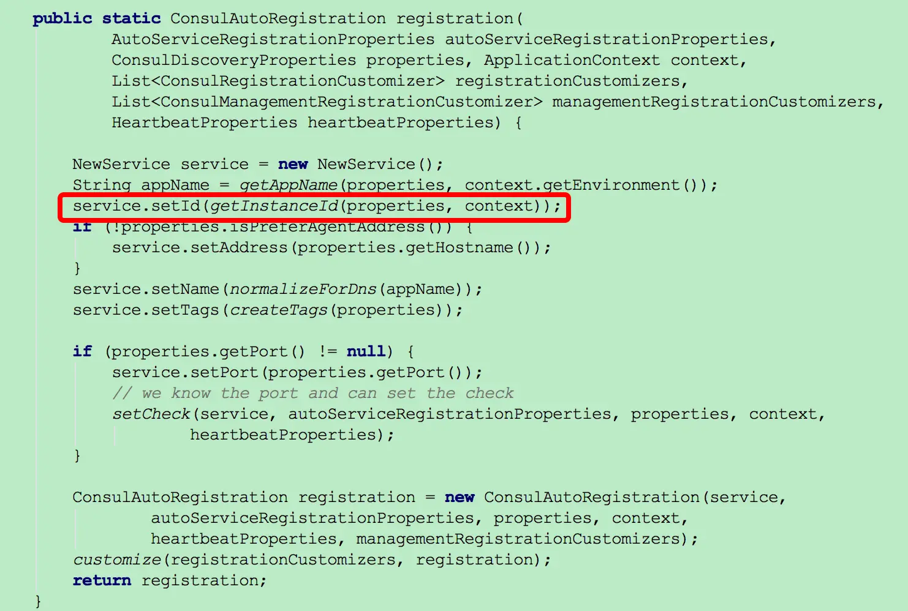

   进入getInstanceId方法中，可以看到最终是调用IdUtils工具类的getDefaultInstanceId方法生成出实例ID(如下图)，

   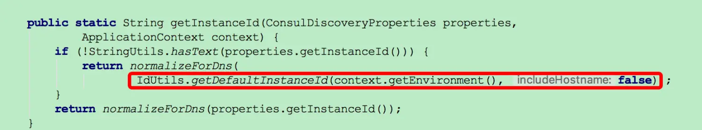

   进入getDefaultInstanceId方法可以看出默认实例的生成规则是{应用名}:{端口号}(如下图)。

   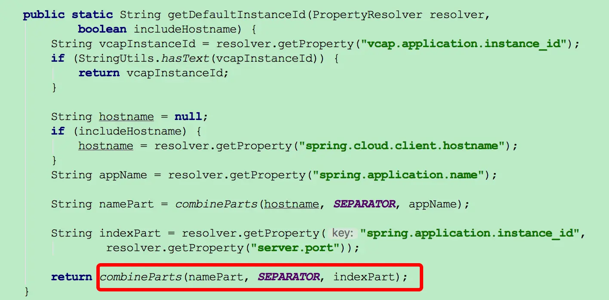


