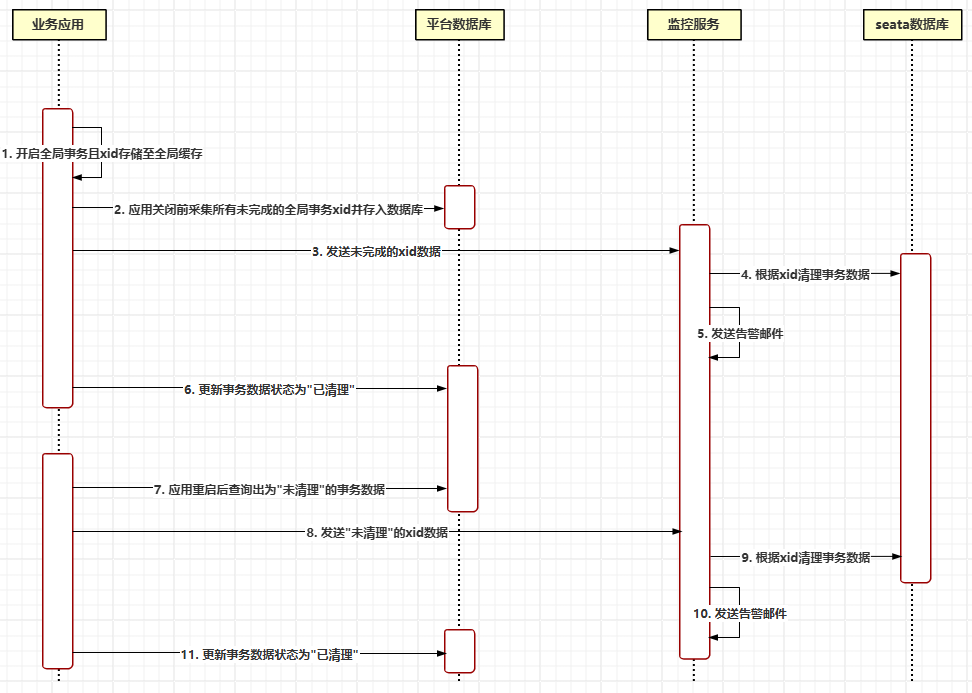
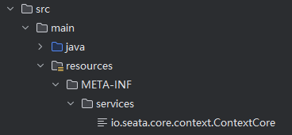

# 分布式事务Seata之服务治理

我们在使用Seata的AT时候，有时会因为并发脏读的场景undolog镜像数据与目标表数据不一致导致回滚失败或提交失败，并且默认会不停地重试，引起应用疯狂输出日志，所以对于这种情况，我们需要对脏数据的undolog做清理与告警等工作。另一种场景是业务应用意外down掉导致开启的全局事务未close掉，导致SeataServer的记录锁残留，后期有变更相同记录时候获取锁失败，所以针对这种场景也需要做及时的清理、告警动作，之后再人工介入做后续的数据修复等工作。


## 1. 清理undolog

官方默认处理失败的事务的实现（DefaultFailureHandlerImpl）主要是输出警告日志，所以我们需要重写commit、rollback失败处理的相应方法，即继承DefaultFailureHandlerImpl（或实现FailureHandler接口）覆写onCommitFailure()、onRollbackFailure()，首先备份当前undolog，然后删除此undolog记录，最后通过告警平台发出告警信息，大致的实现逻辑代码如下：


```java
/**
 *  自定义seata失败处理器，用于处理事务提交和回滚失败的情况。当提交或回滚失败时，需要清理相关的undo_log数据，并发起告警。
 */
public class SeataFailureHandlerImpl extends DefaultFailureHandlerImpl {
	
    /* 清理undo日志开关 */
    private Boolean cleanEnabled;
    
    
    @Override
    public void onCommitFailure(GlobalTransaction tx, Throwable cause) {
        super.onCommitFailure(tx, cause);

        // 处理undo日志, 清理完后再发送告警
        this.processUndoLog(tx);
    }

    @Override
    public void onRollbackFailure(GlobalTransaction tx, Throwable originalException) {
        super.onRollbackFailure(tx, originalException);

        // 处理undo日志, 清理完后再发送告警
        this.processUndoLog(tx);
    }
	
    /**
     * 处理undo日志, 清理完之后再发送告警
     * @param tx
     */
    private void processUndoLog(GlobalTransaction tx) {
        if (cleanEnabled) {
            // 1. 备份undolog记录
            String content = backupUndolog(tx.getXid());
            // 2. 清理undolog记录
            cleanUndoLog(tx.getXid())
            // 3. 推送告警消息
            sendWarnMsg(content);
        }    
    }
    
    
    ............
            
}    
```


## 2. 清理锁残留

具体方案流程是当应用服务重启时，主动上报监控端当前未完成的全局事务并且做自动清理锁残留脏数据，以及发送告警邮件：



- 如何采集应用未完成的全局事务XID？

  由于全局事务XID只存储在当前线程的上下文中，当事务结束时会被立即清理掉，所以无法拿到所有线程的上下文中的XID，后来通过源码了解到官方用来存储上线文的接口ContextCore有两个默认实现ThreadLocalContextCore、FastThreadLocalContextCore并且他们支持SPI机制，所以只需要实现ContextCore接口通过SPI机制设置自定义的实现为高优先级，然后在此实现中绑定的时候XID存入全局Map中，解绑的时候清理XID，这样就可以采集到当前应用未完成的所有事务XID，具体实现如下：

  ```java
  /**
   * 自定义seata的线程上下文
   */
  @LoadLevel(name = "seataThreadLocalContextCore", order = Integer.MAX_VALUE)
  public class SeataThreadLocalContextCore implements ContextCore {
  
      /* 线程变量存储池 */
      private ThreadLocal<Map<String, Object>> threadLocal = ThreadLocal.withInitial(HashMap::new);
  
  
      @Nullable
      @Override
      public Object put(String key, Object value) {
          Map<String, Object> context = threadLocal.get();
  
          if (StringUtils.hasText(key) && ! Objects.isNull(value)) {
              // begin transaction
              if (RootContext.KEY_XID.equals(key)) {
                  // 缓存全局事务数据
                  String xid = value.toString();
                  GlobalTransactionEntity entity = new GlobalTransactionEntity();
                  entity.setXid(xid);
                  entity.setBeginTime(new Timestamp(System.currentTimeMillis()));
                  SeataGlobalTransactionHolder.getInstance().putIfAbsent(xid, entity);
              }
              // branch type
              else if (RootContext.KEY_BRANCH_TYPE.equals(key)) {
                  Object xidObj = context.get(RootContext.KEY_XID);
                  if (! Objects.isNull(xidObj)) {
                      GlobalTransactionEntity entity = SeataGlobalTransactionHolder.getInstance().get(xidObj.toString());
                      if (! Objects.isNull(entity)) {
                          entity.setBranchType( value == BranchType.AT ? "AT" : "XA" );
                      }
                  }
              }
          }
  
          return context.put(key, value);
      }
  
      @Nullable
      @Override
      public Object get(String key) {
          return threadLocal.get().get(key);
      }
  
      @Nullable
      @Override
      public Object remove(String key) {
          Map<String, Object> context = threadLocal.get();
  
          if (StringUtils.hasText(key)) {
              // finish transaction
              if (RootContext.KEY_XID.equals(key)) {
                  // 删除全局事务缓存数据
                  SeataGlobalTransactionHolder.getInstance().remove(key);
              }
          }
  
          return context.remove(key);
      }
  
      @Override
      public Map<String, Object> entries() {
          return threadLocal.get();
      }
  }
  ```

  ```java
  /**
   * 自定义全局事务上下文, 用于保存全局事务xid
   */
  public class SeataGlobalTransactionHolder {
  
      /* 存储全局事务数据 */
      private static final ConcurrentMap<String, GlobalTransactionEntity> globalTransactionMap;
  
      private SeataGlobalTransactionHolder() {}
  
      static {
          globalTransactionMap = new ConcurrentHashMap<>();
      }
  
      private static class SeataGlobalTransactionContextInner {
          private static final SeataGlobalTransactionHolder INSTANCE = new SeataGlobalTransactionHolder();
      }
  
      /**
       * 获取SeataGlobalTransactionContext实例
       * @return
       */
      public static SeataGlobalTransactionHolder getInstance() {
          return SeataGlobalTransactionContextInner.INSTANCE;
      }
  
      /**
       * 存储事务数据
       * @param xid
       * @param globalTransactionEntity
       * @return
       */
      public GlobalTransactionEntity putIfAbsent(String xid, GlobalTransactionEntity globalTransactionEntity) {
          return globalTransactionMap.putIfAbsent(xid, globalTransactionEntity);
      }
  
      /**
       * 获取事务数据
       * @param xid
       * @return
       */
      public GlobalTransactionEntity get(String xid) {
          return globalTransactionMap.get(xid);
      }
  
      /**
       * 删除事务数据
       * @param xid
       * @return
       */
      public GlobalTransactionEntity remove(String xid) {
          return globalTransactionMap.remove(xid);
      }
  
      /**
       * 获取所有全局事务数据
       * @return
       */
      public List<GlobalTransactionEntity> getAll() {
          return new ArrayList<>(globalTransactionMap.values());
      }
  }
  ```

  在META-INF/services/下配置ContextCore接口自定义实现类：

  


- 什么时机触发清除动作？

  当应用down的时候触发，应用是基于Spring管理的所以通过监听Spring Context在destroy之前触发清除动作，比如使用@PreDestroy或者实现 DisposableBean接口的destroy() 方法，例如：

  ```java
      /**
       * Spring容器销毁前触发未完成的全局事务数据并且通知监控服务清理脏数
       * @throws Exception
       */
      @PreDestroy
      public void onDestroy() throws Exception {
          
          SeataNoticeScheduler.cleanUp();
         
      }
  ```

  