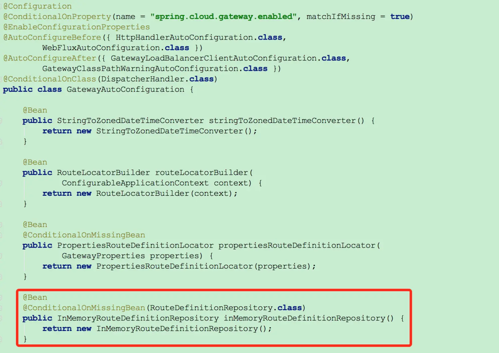

# 基于Nacos配置的SpringCloudGateway动态路由实现

Spring Cloud Gateway配置路由的方式主要有两种方式，其一是在yml文件中配置，其二是通过硬编码创建RouteLocator实例，但是这两种方式都不支持动态配置，我们的需求是通过Nacos配置中心变更路由规则，Gateway能够实时刷新然后立即生效，基于这种需求，目前思路是通过注册Nacos配置服务的监听器，待收到服务端配置变更的事件后主动刷新Gateway的路由缓存。



通过源码Gateway自动配置类GatewayAutoConfiguration发现(如上图)，RouteDefinitionRepository的实现类是用来存储路由信息的，唯一的实现类是InMemoryRouteDefinitionRepository，根据条件判断注解，在实例化过程中首先查找Spring上下文有没有自定义的RouteDefinitionRepository实现类，如果没有默认用InMemoryRouteDefinitionRepository，所以做动态路由只要实现RouteDefinitionRepository接口即可，具体实现如下：

- 引入nacos客户端pom依赖

  ```xml
      <dependency>
          <groupId>com.alibaba.nacos</groupId>
          <artifactId>nacos-client</artifactId>
          <version>1.1.4</version>
      </dependency>
  ```

  

- Nacos服务的配置类，主要为了实例化ConfigService

  ```java
  @Component
  @ConfigurationProperties(prefix = "nacos")
  @Data
  public class NacosConfig {
  
      /* 服务地址 */
      private String serverAddr;
  
      /* 命名空间 */
      private String namespace;
  
      /**
       * encode for nacos config content.
       */
      private String encode = "UTF-8";
  
      /**
       * nacos maximum number of tolerable server reconnection errors.
       */
      private String maxRetry = "3";
  
      /**
       * nacos get config long poll timeout.
       */
      private String configLongPollTimeout;
  
      /**
       * nacos get config failure retry time.
       */
      private String configRetryTime;
  
      /**
       * If you want to pull it yourself when the program starts to get the configuration
       * for the first time, and the registered Listener is used for future configuration
       * updates, you can keep the original code unchanged, just add the system parameter:
       * enableRemoteSyncConfig = "true" ( But there is network overhead); therefore we
       * recommend that you use {@link ConfigService#getConfigAndSignListener} directly.
       */
      private boolean enableRemoteSyncConfig = false;
  
      /**
       * endpoint for Nacos, the domain name of a service, through which the server address
       * can be dynamically obtained.
       */
      private String endpoint;
  
      /**
       * access key for namespace.
       */
      private String accessKey;
  
      /**
       * secret key for namespace.
       */
      private String secretKey;
  
      /**
       * context path for nacos config server.
       */
      private String contextPath;
  
      /**
       * nacos config cluster name.
       */
      private String clusterName;
  
  
      /**
       * 组装配置参数
       * @return
       */
      public Properties assembleConfigServiceProperties() {
          Properties properties = new Properties();
          properties.put(SERVER_ADDR, Objects.toString(this.serverAddr, ""));
          properties.put(ENCODE, Objects.toString(this.encode, ""));
          properties.put(NAMESPACE, Objects.toString(this.namespace, ""));
          properties.put(ACCESS_KEY, Objects.toString(this.accessKey, ""));
          properties.put(SECRET_KEY, Objects.toString(this.secretKey, ""));
          properties.put(CONTEXT_PATH, Objects.toString(this.contextPath, ""));
          properties.put(CLUSTER_NAME, Objects.toString(this.clusterName, ""));
          properties.put(MAX_RETRY, Objects.toString(this.maxRetry, ""));
          properties.put(CONFIG_LONG_POLL_TIMEOUT,
                  Objects.toString(this.configLongPollTimeout, ""));
          properties.put(CONFIG_RETRY_TIME, Objects.toString(this.configRetryTime, ""));
          properties.put(ENABLE_REMOTE_SYNC_CONFIG,
                  Objects.toString(this.enableRemoteSyncConfig, ""));
          String endpoint = Objects.toString(this.endpoint, "");
          if (endpoint.contains(":")) {
              int index = endpoint.indexOf(":");
              properties.put(ENDPOINT, endpoint.substring(0, index));
              properties.put(ENDPOINT_PORT, endpoint.substring(index + 1));
          } else {
              properties.put(ENDPOINT, endpoint);
          }
  
          return properties;
      }
  
  
      /**
       * 实例化Nacos配置服务
       * @return
       */
      @Bean
      public ConfigService configService() throws NacosException {
          return NacosFactory.createConfigService(this.assembleConfigServiceProperties());
      }
  
      /**
       * 实例化Nacos路由定义存储器
       * @return
       */
      @Bean
      public NacosRouteDefinitionRepository nacosRouteDefinitionRepository(ApplicationEventPublisher 		 
                                                              publisher,ConfigService configService) {
          return new NacosRouteDefinitionRepository(publisher, configService);
      }
  }
  ```

  

- 自定义Nacos路由存储器

  ```java
  /**
   * Nacos路由定义存储器
   */
  @Slf4j
  public class NacosRouteDefinitionRepository implements RouteDefinitionRepository {
      /* nacos配置属性 */
      private static final String NACOS_DATA_ID  =  "gateway";
      private static final String NACOS_GROUP    =  "DEFAULT_GROUP";
  
      private final Map<String, RouteDefinition> routes = Maps.newHashMap();
  
      private ApplicationEventPublisher publisher;
  
      private ConfigService configService;
  
      public NacosRouteDefinitionRepository(ApplicationEventPublisher publisher,
                                            ConfigService configService) {
          this.publisher      =  publisher;
          this.configService  =  configService;
  
          initRouteDefinitions();
          registerNacosListener();
      }
  
      @Override
      public Flux<RouteDefinition> getRouteDefinitions() {
          return Flux.fromIterable(routes.values());
      }
  
      @Override
      public Mono<Void> save(Mono<RouteDefinition> route) {
          return null;
      }
  
      @Override
      public Mono<Void> delete(Mono<String> routeId) {
          return null;
      }
  
  
      /**
       *  初始化路由
       */
      private void initRouteDefinitions() {
          this.loadRouteDefinitions();
      }
  
      /**
       * 注册Nacos监听
       */
      private void registerNacosListener() {
          try {
              this.configService.addListener(NACOS_DATA_ID, NACOS_GROUP, new NacosListener());
          } catch (NacosException e) {
              log.error("register nacos listener error:{}", ExceptionUtils.getStackTrace(e));
          }
      }
  
      /**
       * 加载路由
       */
      private void loadRouteDefinitions() {
          try {
              String content = configService.getConfig(NACOS_DATA_ID, NACOS_GROUP,5000);
              List<RouteDefinition> routeDefinitions = convert(content);
              routeDefinitions.forEach(routeDefinition -> {
                  routes.put(routeDefinition.getId(), routeDefinition);
              });
          } catch (Exception e) {
              if (e instanceof NacosException) {
                  log.error("loadRouteDefinitions from nacos error:{}", ExceptionUtils.getStackTrace(e));
              } else {
                  log.error("loadRouteDefinitions error:{}", ExceptionUtils.getStackTrace(e));
              }
          }
      }
  
      /**
       * 转换路由
       * @param content 路由内容
       * @return
       */
      private List<RouteDefinition> convert(String content) throws IOException {
          if (StringUtils.isNotBlank(content)) {
              String result = PropertiesUtil.getKey(content, "gateway.routes");
              if (StringUtils.isNotBlank(result) ) {
                  return JSONObject.parseArray(result, RouteDefinition.class);
              }
          }
          return Lists.newArrayList();
      }
  
      /* Nacos配置事件监听 */
      private class NacosListener implements Listener {
  
          @Override
          public Executor getExecutor() {
              return null;
          }
  
          @Override
          public void receiveConfigInfo(String configInfo) {
              synchronized (NacosListener.class) {
                  loadRouteDefinitions();
              }
              // 发布刷新路由事件
              publisher.publishEvent(new RefreshRoutesEvent(this));
          }
      }
  }
  ```

  

  自定义路由存储器，注册自定义的Nacos监听器，实现receiveConfigInfo方法，当收到Nacos服务端配置变更事件后，会调用receiveConfigInfo方法，然后去加载最新的路由配置信息并存入Map中(参考了InMemoryRouteDefinitionRepository实现，将路由信息用Map存储，通过路由ID去重)，最后发布刷新路由事件(RefreshRoutesEvent)，缓存路由定位器CachingRouteLocator会监听该事件，并重新拉取最新的路由配置信息，实时生效。

