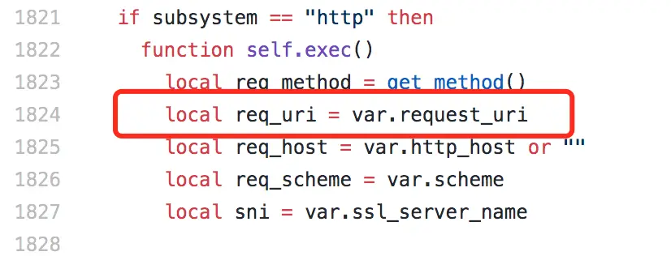
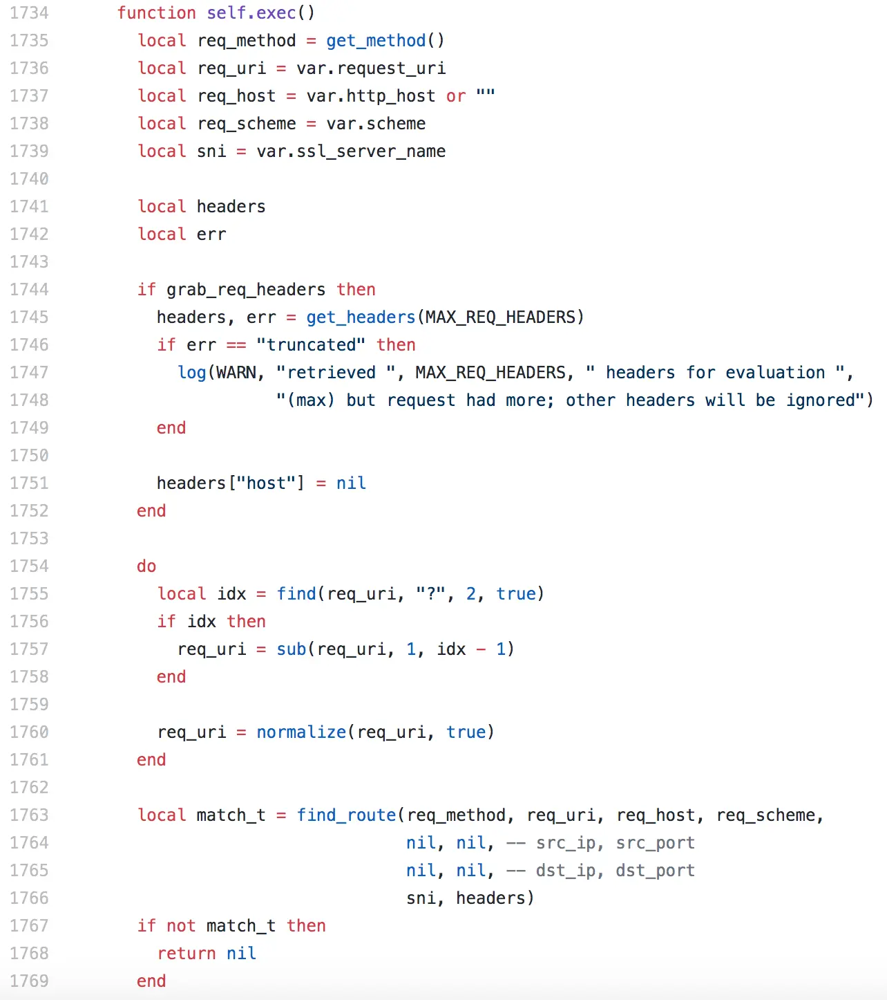
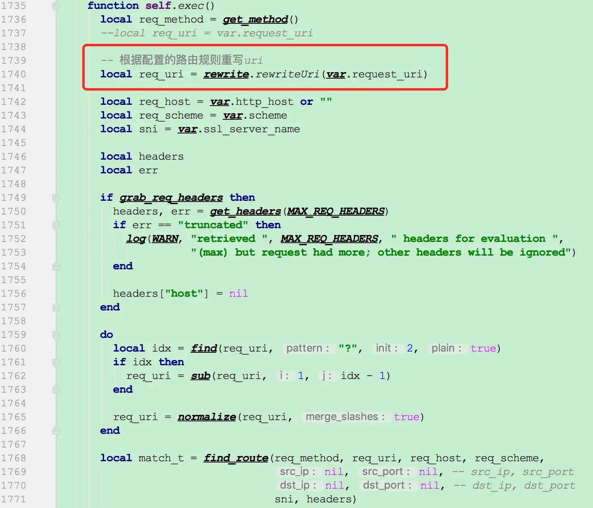

# 流量网关Kong定制化多维度转发


1.  Kong官方源码GitHub:  https://github.com/Kong/kong

2.  定制开发需求

   - 根据匹配的URL做转发
   - 根据匹配的Cookie做转发
   - 根据匹配的Header做转发

3.  Kong流程分析

   根据nginx配置文件最能体现kong的插件加载过程，来分析kong的执行流程：

   ```lua
   server {
      server_name kong;
      rewrite_by_lua_block {
         Kong.rewrite()
      }
      access_by_lua_block {
         Kong.access()
      }
      header_filter_by_lua_block {
        Kong.header_filter()
      }
      body_filter_by_lua_block {
        Kong.body_filter()
      }
      log_by_lua_block {
        Kong.log()
      }
   }
   ```

   1>. 重点关注Kong.rewrite()和Kong.access()两个方法
         a). rewrite方法：从客户端接收作为重写阶段处理程序的每个请求执行。在这个阶段，无论是API还是消费者都没有被识别，因此

   ​                                   这个处理器只在插件被配置为全局插件时执行。

   ​      b). access方法：为客户的每一个请求而执行，并在它被代理到上游服务之前执行。

   2>. 通过源码得知，rewrite()阶段操作的是ngx.var.uri变量，在请求处理过程中可以更改，例如执行内部重定向后，而access()阶段

   ​       kong在路由匹配的时候使用的是ngx.var.request_uri原始uri，并且不可变。

   ​	   参考router.lua文件：

   ​	   

   3>. 在匹配路由前，重写ngx.var.request_uri，以便达到根据请求URL或Cookie或Header中的配置值做路由转发。

   

4.  定制开发

   修改kong/router.lua脚本，根据分发路由规则重写var.request_uri（图二红框代码）。

   下图是修改前的源代码：

   

​      

​      下图是改造后的代码：


