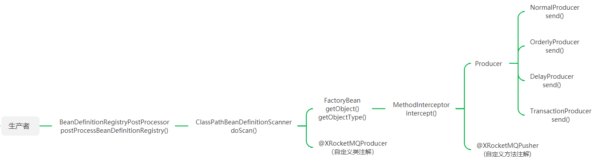
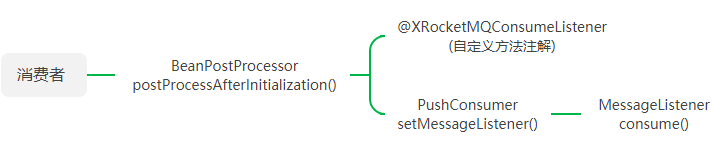

# Springboot集成RocketMQ

为什么不使用官方的springboot与rocketmq的集成方案，主要是从团队的需求以及高度包装带来的开发便利性出发，做更深层次的集成封装工作，并且除了基本的消息收发，还额外增加了对收发消息前后拦截器功能，便于植入业务功能。

## 1. 设计思路

### 1.1 生产者

​		 官方生产者的实现主要是通过Template类（RocketMQTemplate），提供各种消息发送的API，本组件的实现思路是通过自定义注解，以及各种不同类型消息的参数，借鉴了mybatis与spring集成的思路，通过自定义前置处理器（BeanDefinitionRegistryPostProcessor）与动态代理来实现消息的发送，而且特别对事务消息做了特殊封装。

1. 自定义生产者类注解@XRocketMQProducer以及方法注解@XRocketMQPusher

2. 实现org.springframework.beans.factory.support.BeanDefinitionRegistryPostProcessor接口，覆写postProcessBeanDefinitionRegistry(beanDefinitionRegistry)方法，动态修改bean定义

3. 1. ) 覆写org.springframework.context.annotation.ClassPathBeanDefinitionScanner类中的doScan(basePackages)方法，过滤出@XRocketMQProducer修饰的接口的BeanDefinition

   2. ) 修改BeanDefinition，将其beanClass设置成org.springframework.beans.factory.FactoryBean的实现类，用于bean的代理对象实例化

   3. ) 实现org.springframework.beans.factory.FactoryBean接口，覆写getObject()、getObjectType()方法，其中getObjectType返回的是bean实际接口的class，而getObject返回是bean的cglib代理对象

   4. ) 实现org.springframework.cglib.proxy.MethodInterceptor接口，覆写intercept(obj,method,args,methodProxy)方法，过滤出@XRocketMQPusher修饰的方法，然后调用Producer实例的send()发送消息

   5. ) Producer根据消息类型又分为：Normal（普通）、Orderly（顺序）、Delay（延时）、Transaction（事务）等实现

      

### 1.1 消费者

​		 官方消费者的实现主要通过消息监听注解方式实现的，而且是类注解（@RocketMQMessageListener）且还需要实现接口（RocketMQListener）中的onMessage方法，所以每监听一种消息都需要定义一个消费类，比较繁琐，本组件实现的思路也是通过注解方式，但是是方法的注解，所以要简洁一些，通过自定义后置处理器（BeanPostProcessor）与反射结合实现消息的接收。

1. 自定义消费者（consumer）方法注解监听器@DWRocketMQConsumeListener

2. 实现org.springframework.beans.factory.config.BeanPostProcessor接口，覆写postProcessAfterInitialization(bean,beanName)方法

3. 1. ) 通过反射查找此bean的方法上带有@XRocketMQConsumeListener修饰的方法集合
   2. ) 遍历查找到的方法集合（java.lang.reflect.Method），然后分别创建消费者实例（PushConsumer）与之绑定
   3. ) 消费者实例（org.apache.rocketmq.client.apis.consumer.PushConsumer）依赖消息监听器MessageListener进行消息消费
   4. ) 实现org.apache.rocketmq.client.apis.consumer.MessageListener接口，覆写consume(messageView)，并且通过反射直接调用此Method的invoke(obj,args)方法