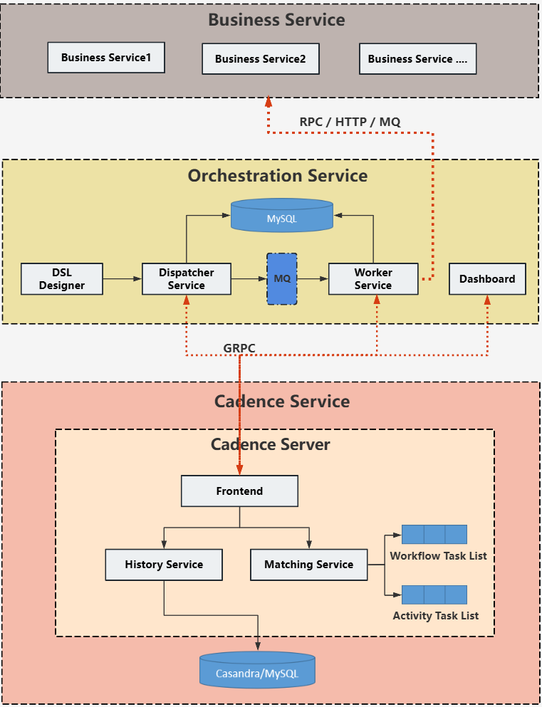
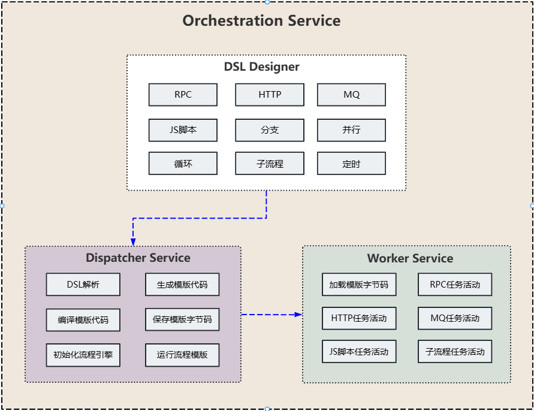

# 微服务编排

## 背景

随着业务不断增长，业务系统拆分的越来越细，会引入各种痛点，如：分布式系统中部分失败难以处理、传统服务无法有效管理可能持续数小时/天的业务流程、多个异步服务调用间的依赖关系难以维护、业务逻辑被分散到各个服务中难以维护等等，所以引入服务编排，将分布式系统的复杂性从业务代码中抽离，使开发者能够更专注于业务逻辑本身，而非分布式环境下的各种边缘情况处理，目前主流的流程编排引擎有：Cadence、Temporal、AWS Step Functions、Netflix Conductor等，由于一些原因此项目选择Cadence作为流程编排引擎（如果是新项目的话可以重点考虑Temporal他是在Cadence孵化出来的）。

## 整体方案设计

整体架构设计图如下：

​		整个方案涉及三大块，即：业务服务应用（business service）、服务编排服务（orchestration service）、流程引擎服务

​     （cadence service）。

​		**业务应用层（business service）**：被拆分的业务应用服务，对外提供业务接口，便于业务编排。

​		**服务编排层（orchestration service）**：涉及DSL流程定义（dsl designer）、流程模版分发（dispatcher service）、流程活动执 

​                                                                                行（worker service）、流程管理面板（dashboard）等子系统。

​		**流程引擎层（cadence service）**：cadence服务，包括：前端服务（frontend）、历史服务（history service）、匹配服务

​                                                                   （matching service）、数据存储（cassandra/mysql）等组件。

## 服务编排设计

服务编排业务架构图如下：

主要由DSL流程设计器（dsl designer）、流程模版分发器（dispatcher service）、活动执行器（worker service）等子服务构成。

**DSL流程设计器（dsl designer）**：根据具体业务可以分成RPC、HTTP、MQ、JS脚本、分支、并行、循环、子流程、定时等任务节点，

​														     当设计完流程编排之后，最终以JSON形式保存DSL定义的流程。

**流程模版分发器（dispatcher service）**：主要提供DSL解析、组装流程模板代码、编译流程模版代码、保存流程模版字节码、流程引擎

​																		  客户端实例创建、发起流程模版的执行等功能。

**活动执行器（worker service）**：具体流程模版里的活动任务的执行，包括：RPC、HTTP、MQ、JS脚本、子流程等任务活动的具体实

​														   现，且具有动态加载流程模版字节码功能。
