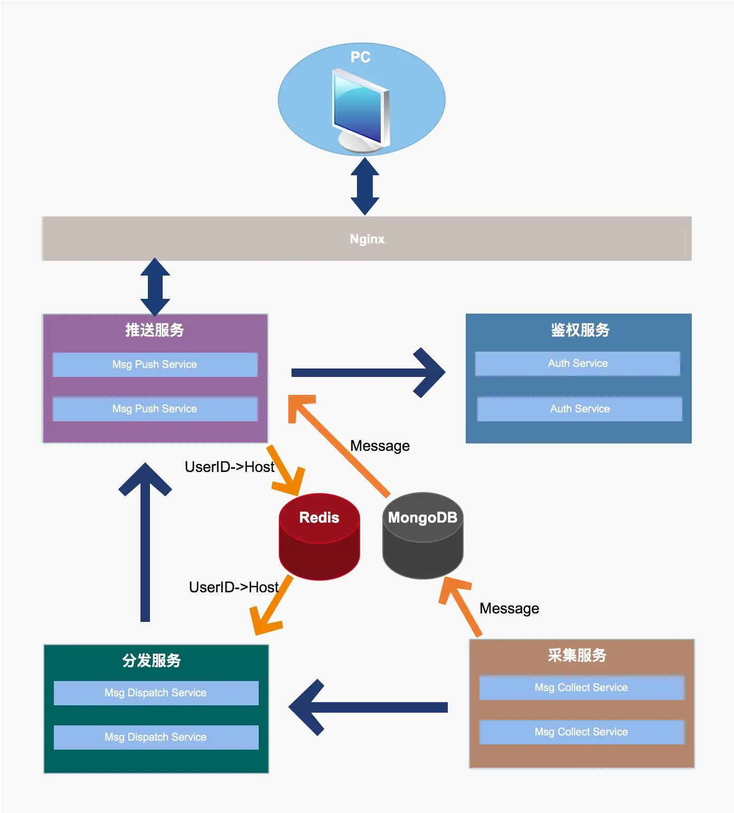

# 基于go的websocket消息推送的集群实现

## 背景

目前websocket技术已经很成熟，选型Go语言，当然是为了节省成本以及它强大的高并发性能。我使用的是第三方开源的websocket库即gorilla/websocket。

## 方案设计
由于我们线上推送的量不小，推送后端需要部署多节点保持高可用，所以需要自己做集群，具体架构方案如图：

- 
  Auth Service：鉴权服务，根据Token验证用户权限。

- Collect Service：消息采集服务，负责收集业务系统消息，存入MongoDB后，发送给消息分发服务。
- Dispatch Service：消息分发服务，根据路由规则分发至对应消息推送服务节点上。
- Push Service：消息推送服务，通过websocket将消息推送给用户。

集群推送的关键点在于，web端与服务端建立长连接之后，具体跟哪个推送节点保持长连接的，如果我们能够找到对应的连接节点，那么我们就可以将消息推送出去。下面讲解一下集群的大致流程：

1.  web端用户登录之后，带上token与后端推送服务（Push Service）保持长连接。
2.  推送服务收到连接请求之后，携带token去鉴权服务（Auth Service）验证此token权限，并返回用户ID。
3.  把返回的用户ID与长连接存入本地缓存，保持用户ID与长连接绑定关系。
4.  再将用户ID与本推送节点IP存入redis，建立用户（即长连接）与节点绑定关系，并设置失效时间。
5.  采集服务（Collect Service）收集业务消息，首先存入mongodb，然后将消息透传给分发服务（Dispatch Service）。
6.  分发服务收到消息之后，根据消息体中的用户ID，从redis中获取对应的推送服务节点IP，然后转发给对应的推送节点。
7.  推送服务节点收到消息之后，根据用户ID，从本地缓存中取出对应的长连接，将消息推送给客户端。

## 重要事项

1.  如何清理推送服务节点的失效长连接？
    上述第四步用户ID与节点存入redis时设置了过期时间，我们通过订阅Redis的键事件通知（key-event notification），清理掉过期的长连接。
2.  用户（即长连接）与节点绑定关系如何续期？
     客户端与推送服务端建立心跳机制（报文带上token），定期刷新redis中用户与节点绑定关系时间。
3.  如何保证长连接一直可用？
     心跳重连机制，客户端定时往服务端发送心跳报文以检测连接是否正常。
